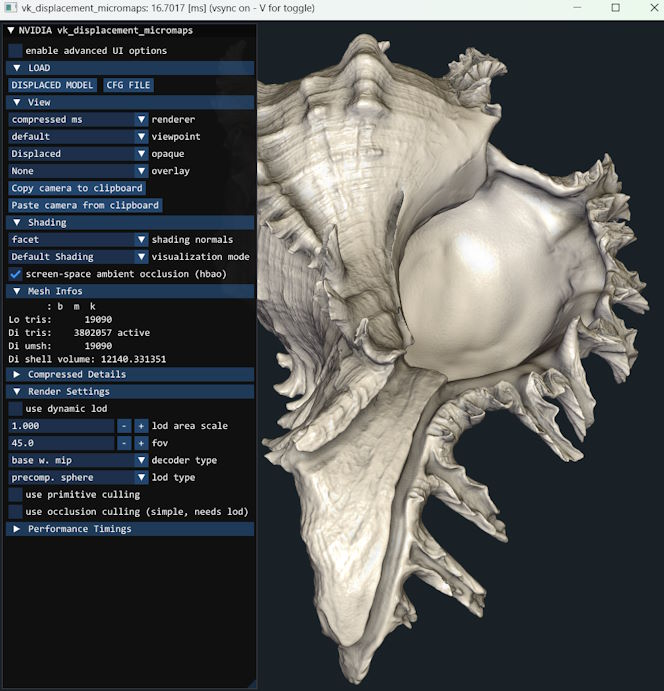

# vk_displacement_micromaps

This is a sample for rendering models using displacement micromaps resulting in a displaced [NVIDIA Micro-Mesh](https://developer.nvidia.com/rtx/ray-tracing/micro-mesh). Micromeshes are a new geometry representation to allow high geometric complexity with a reduced memory footprint and fast BVH build times for ray-tracing.

Please refer to any additional details:
- For a basic introduction we recommend to check the [Micro-Mesh Basics slides](https://developer.download.nvidia.com/ProGraphics/nvpro-samples/slides/Micro-Mesh_Basics.pdf) first as well as the [dmm_displacement mini-sample](https://github.com/NVIDIAGameWorks/Displacement-MicroMap-Toolkit/blob/main/mini_samples/dmm_displacement/README.md).
- Here is also details about the fundamental [Micromesh data structures](https://github.com/NVIDIAGameWorks/Displacement-MicroMap-Toolkit/blob/main/docs/data_structures.md)
- Rasterizing displaced micromeshes is described in the [Micro-Mesh Rasterization slides](https://developer.download.nvidia.com/ProGraphics/nvpro-samples/slides/Micro-Mesh_Rasterization.pdf)
- Creating displaced micromeshes via the [NVIDIA Displacement-MicroMap-Toolkit](https://github.com/NVIDIAGameWorks/Displacement-MicroMap-Toolkit). This sample here is just about rendering already prepared asset.

While micromeshes were mostly designed for raytracing hardware, this sample focuses a lot on their rasterization through either mesh shaders or compute shaders. It does, however, also implement a renderer for raytracing. The rasterization is demonstrated for both HW rasterization with task and mesh shaders and a "software" compute shader based approach that works well for near pixel-sized triangles.

This sample may also be interesting to those looking into doing custom tessellation for rasterization beyond the traditional tessellation shaders.

> Note: The Vulkan SDK may not yet contain a shaderc version that supports all the features of this sample. See *Known Issues* towards the end of this document.

**Fixed Meshlet Allocation**

As mesh shaders or compute shaders use fixed allocation schemes for the number of vertices/triangles they operate on, we want to maximize the use of that memory. For mesh shaders this is the output space (`layout(max_vertices = ..., max_primitives = ...) out;`), for compute shaders we use shared memory to store transient data. Both are configured to `64 vertices` and `64 triangles`.

A micromesh is the result of power-of-two subdivision of a basetriangle. We want to create the necessary triangle topology on-the-fly within the meshlet allocation.

A key feature and complexity is load balancing shader work with varying subdivision levels. Both approaches rely on fixed meshlet allocations and therefore are efficient when they are utilizing that well. Triangles with high subdivision can be distributed over multiple meshlets and those with low subdivision can be batched together.

Micromeshes support up to subdivision level 5, which is 1024 triangles. That means we need up to 16 x 64 meshlets to render such a displaced triangle. In the shader code we refer to such partial regions of the input triangle as *parts*. We can also *pack* multiple lower subdivision levels into one meshlet:

| Subdivision Level | Microtriangles | Parts / Meshlets | Packed | Utilized Triangles | Utilized Vertices
|-------------------|----------------|------------------|--------|--------------------|-------------------|
|                 0 |       1        |    1             |     16 |                16  |               48  |
|                 1 |       4        |    1             |      8 |                32  |               48  |
|                 2 |      16        |    1             |      4 |                64  |               60  |
|                 3 |      64        |    1             |      1 |                64  |               45  |
|                 4 |     256        |    4             |      1 |                64  |               45  |
|                 5 |    1024        |   16             |      1 |                64  |               45  |

To rasterize micromeshes some key operations must be performed:

- **Task Shading Phase**: Implemented in the task shader, or as separate dispatch for compute shaders. We operate on a batch of basetriangles.
  - **Coarse Culling & LoD computation**: For each basetriangle we do rudimentary culling and we can also alter the subdivision level through dynamic level of detail.
  - **Bin Packing**: As basetriangles can yield different target subdivision levels, we risk under utilizing the meshlet allocation if we render small subdivision levels individually. For example subdivision level 2 yields 16 triangles, but we have space for 64. Therefore, bins of same subdivision level are created and packed accordingly (see table above). In the subsequent *mesh shading phase* the bins are decoded.
- **Mesh Shading Phase**: Implemented in the mesh shader, or as separate dispatch for compute shaders. We operate either on a part of a basetriangle using all threads in the workgroup, or on multiple low subdivision level basetriangles packed together, where each gets an equal fraction of threads of the workgroup.
  - **Micro-Triangle Generation**: A micromesh is the result of power-of-two subdivision of a basetriangle. We want to create the necessary triangle topology on-the-fly within the meshlet allocation. In this process we need to respect the edge decimation flags and ensure the resulting triangles are watertight with the tessellation of neighboring basetriangles at lower subdivision. Rasterization also allows to dynamically adjust the subdivision level and implement a level of detail (LOD) scheme.
  - **Micro-Vertex Decoding**: There are two ways to get the object-space microvertex position:
    - Leveraging an intrinsic `vec3 fetchMicroTriangleVertexPositionNV(sceneTLAS, instanceID, ...)` to get the object-space position directly from an instance. This is hardware-assisted and means we can use the `VkMicromapEXT`'s opaque data directly and as result do not need additional memory. The fetch implicitly snaps vertices according to the edge decimation flags of that primitive (via  `VkAccelerationStructureTrianglesDisplacementMicromapNV::displacedMicromapPrimitiveFlags`), and therefore can yield degenerated triangles.
    - Decoding the displacement manually from the uncompressed or compressed displacement data. The benefit of this approach can be performance, as well as improved portability for rendering micromeshes on platforms that may not support it in hardware.

We recommend the [Micro-Mesh Rasterization slides](https://developer.download.nvidia.com/ProGraphics/nvpro-samples/slides/Micro-Mesh_Rasterization.pdf) which illustrate these operations in more detail.

This sample implements both vertex decoding variants through an abstract interface [`micromesh_decoder_api.glsl`](micromesh_decoder_api.glsl). The decoding process adds a healthy amount of code complexity and this layered api does allow benchmarking different decoders more easily (during research even more variants had existed). However, it should be noted that this setup could be simplified, if only the intrinsics were targeted.

The decoder implementations currently make use of several pre-computed lookup tables, to get key properties of each vertex within the meshlet as well as the meshlet index buffer permutations that are relevant.
Similar as before, if we would only ever use the intrinsic-based decoder, some of this could be more easily handled at runtime, by computing vertex uv-coordinates on the fly.

> Note: On NVIDIA hardware launching compute shader workgroups with just 32 threads may yield suboptimal performance. Hence some of the compute shaders in this sample are set to do the equivalent of two jobs at a time, increasing the threads per workgroup. The values for `MICRO_FLAT_MESH_GROUPS`, `MICRO_FLAT_TASK_GROUPS` and `MICRO_FLAT_SPLIT_TASK_GROUPS` were based on a few benchmarks.

## Loading

By default the sample will load `umesh_Murex_Romosus_compressed.gltf` which can be found in the `downloaded_resources/umesh_Murex_Romosus` directory. There is also a version using uncompressed displacements of the file in the same directory, as well as the config files used for the benchmarks mentioned in the slides. The model was converted from [Ramose Murex by Three D Scans](https://threedscans.com/shell/ramose-murex/) as part of the [Micro-Mesh Construction research paper by Maggiordomo et al.](https://micromesh.di.unimi.it/).

The top menu allows to load `gltf` model files.

- `DISPLACED MODEL`: Load a displaced micromesh glTF file. Either compressed or uncompressed displacement data is supported.
- `CFG FILE`: For more complex inputs it is best to store the relevant commandline arguments in a config file and load that instead. Filenames within a config file are loaded relative to it.

The models are represented in the `MeshSet` struct:
- `MeshInfo` represents the geometry of a mesh as a range within the scene's vertex- and indexbuffers.
- `MeshInstance` represents a concrete instance of a geometry with a material and matrix.
- [`common_mesh.h`](common_mesh.h) : GPU / shader representation of the mesh
- [`meshset.hpp`](meshset.hpp) : CPU data
- [`meshset_vk.hpp`](meshset_vk.hpp) : Vulkan representation (buffers etc.)
- [`meshset_vk.cpp`](meshset_vk.cpp)

## Viewing

At the top of the UI you will find some drop-downs to change what variant of the model is rendered, as well as the ability to overlay a wireframe. Although not all renderers will support overlays.

## Rendering

The application always uses downsampling for anti-aliasing, and therefore renders 4x the amount of pixels than seen on screen.
Simple forward-shading is used, you can easily hack the shading output by editing [`draw_shading.glsl`](draw_shading.glsl) and press R to reload.

The renderers only affect the rendering of the displaced data. The list of available renderers in the UI will change depending on whether the loaded file uses compressed or uncompressed data.

Renderer name codes:

- **uncompressed**: renders simple uncompressed displacement data
- **compressed**: renders block-compressed displacement data
- **ms**: rendering via mesh shader
- **cs**: rendering via compute shader, software rasterization using atomic64 bit instructions. Culling/lod and bin packing phase is done in an extra pass and stored in scratch memory. The later actual rasterization pass goes over all the emitted visible bins. The size of the scratch memory buffer can be influenced via `maxvisiblebits` (maximum is `1 << maxvisiblebits`) in the advanced rendering options. The byte size of this buffer is printed to stdout when the renderer is activated.
- **ray**: rendering via raytracing pipeline

### Generic files used by renderers

- [`common.h`](common.h) : Various data structures shared between CPU and GPU representations
- [`draw_shading.glsl`](draw_shading.glsl) : Primary surface shading functions used within the fragment shaders
- [`draw_culling.glsl`](draw_culling.glsl) : Utilities for per-triangle culling

### **uncompressed common data** (rasterization)

- [`common_barymap.h`](common_barymap.h) : data-structures used to encode pre-computed meshlets for the subdivision at different lod levels
- [`common_micromesh_uncompressed.h`](common_micromesh_uncompressed.h) : data-structures used to store the micromesh data
- [`micromesh_culling_uncompressed.glsl`](micromesh_culling_uncompressed.glsl) : Utilities for the culling and dynamic level-of-detail of uncompressed basetriangles

- [`barymap_vk.cpp`](barymap_vk.cpp) : The meshlets that are required to render each subdivision level are pre-generated here
- [`micromesh_uncompressed_vk.cpp`](micromesh_uncompressed_vk.cpp) : CPU preparation of buffers
- [`renderer_uncompressed_vk.cpp`](renderer_uncompressed_vk.cpp) : The renderers for rasterization of compressed displacements.

### **uncompressed ms**

Uses mesh shader to render uncompressed displacement data.

- [`micromesh_binpack.glsl`](micromesh_binpack.glsl) : Utility to help binning micromeshes of same resolution into task memory bins
- [`draw_uncompressed_basic.task.glsl`](draw_uncompressed_basic.task.glsl) : task shader that handles multiple basetriangles and generates variable amount of mesh-shader workgroups.
- [`draw_uncompressed_basic.mesh.glsl`](draw_uncompressed_basic.mesh.glsl) : mesh shader renders all or a portion of the basetriangle's subdivided triangles with uncompressed displacement.
- [`draw_uncompressed_basic.frag.glsl`](draw_uncompressed_basic.frag.glsl)
- [`draw_uncompressed_lod.task.glsl`](draw_uncompressed_lod.task.glsl) : dynamic level-of-detail, task shader that bins basetriangles of same subdivision
- [`draw_uncompressed_lod.mesh.glsl`](draw_uncompressed_lod.mesh.glsl) : dynamic level-of-detail, mesh shader that decodes variable number of basetriangles at once
- [`draw_uncompressed_lod.frag.glsl`](draw_uncompressed_lod.frag.glsl)

### **uncompressed cs**

Uses compute shader to render uncompressed displacement data.

This renderer does basic "software rasterization" using 64-bit atomics. 
Each triangle is sampled in dynamic for loops within a single thread and pixel points 
within the triangle trigger a 64-bit atomicMin at the appropriate output image location.
The upper 32-bit store the depth, and the lower 32-bit a payload.
The final shading is done as fullscreen fragment shader pass and turns the 64-bit 
image into a color and depth output. 

The shading is very much simplified in this samples and always outputs global microtriangle ids as colors.

Software rasterization may be faster than hardware rasterization for subpixel-sized 
triangles and when only simple values need to be rasterized.
The software rasterization logic used here is fairly basic and was not specifically optimized.
It will not handle near or far clipping properly, and larger triangles can quickly lower performance a lot. A more sophisticated renderer would distribute these more complex scenarios to traditional hardware rasterization.

One compute shader pass operates similar to task shader phase and stores the result
in a global scratch buffer. Then an indirect dispatch is computed, which performs the actual rasterization over all visible binpacks.
Internally this global scratch buffer is also referred as "flat" buffer, and the number of maximum visible elements can be set in the advanced UI (`Render Advanced : flat max visible mshlts`).

- [`drast_utils.glsl`](drast_utils.glsl) : Utilities for the software rasterization
- [`micromesh_binpack_flat.glsl`](micromesh_binpack_flat.glsl) : Utility to help binning micromeshes of same resolution into bins and outputting them into a global buffer.
- [`drast_uncompressed_lod_flat_task.comp.glsl`](drast_uncompressed_lod_flat_task.comp.glsl) : dynamic level-of-detail, compute shader that handles multiple basetriangles does culling and dynamic lod and generates variable amount of output bins written in a scratch buffer. The shader file also contains a small compute shader that computes the final dispatch indirect arguments after the task phase.
- [`drast_uncompressed_lod_flat_mesh.comp.glsl`](drast_uncompressed_lod_flat_mesh.comp.glsl) : dynamic level-of-detail, compute shader whose workgroup operates on the binned micromeshes of the global scratch buffer and software-rasterizes them.
- [`drast_shade_uncompressed.frag.glsl`](drast_shade_uncompressed.frag.glsl) : fullscreen fragment shader turning the 64-bit atomic back to color and depth.

### **uncompressed split cs**

This is a version of the previous which does some rasterization directly within the task-shading phase. Namely, all bins that are below subdivision level 3 are rasterized directly.
The other triangles are sent for rasterization in the second pass through the scratch buffer. This can be slightly faster than previous.

- [`micromesh_binpack_flatsplit.glsl`](micromesh_binpack_flatsplit.glsl) : Utility to help binning micromeshes of same resolution into bins. It outputs subdiv == 3 bins into a global buffer, but handles smaller bins directly.
- [`drast_uncompressed_lod_flatsplit_task.comp.glsl`](drast_uncompressed_lod_flatsplit_task.comp.glsl) : dynamic level-of-detail, compute shader that handles multiple basetriangles does culling and dynamic lod and generates variable amount of output bins. Bins with just subdivision level 3 are written to the scratch buffer, others are directly rasterized in this pass. The shader file also contains a small compute shader that computes the final dispatch indirect arguments after the task phase.
- [`drast_uncompressed_lod_flat_mesh.comp.glsl`](drast_uncompressed_lod_flat_mesh.comp.glsl) : dynamic level-of-detail, compute shader whose workgroup operates on the binned micromeshes of the global scratch buffer and software-rasterizes them.

### **compressed ray**

Uses raytracing pipeline to generate an image.

- [`common_micromesh_compressed_rt.h`](common_micromesh_compressed_rt.h) : data-structures used for microvertex normal shading on the GPU
- [`dray_trace.rgen.glsl`](dray_trace.rgen.glsl) : ray generation shader
- [`dray_trace.rhit.glsl`](dray_trace.rhit.glsl) : ray hit shader
- [`dray_trace.rmiss.glsl`](dray_trace.rmiss.glsl) : ray miss shader
- [`dray_blit.vert.glsl`](dray_blit.vert.glsl) : vertex shader (full screen triangle)
- [`dray_blit.frag.glsl`](dray_blit.frag.glsl) : fragment shader that blits the ray tracing result into framebuffer and also writes appropriate `gl_FragDepth` so that the post processing ambient occlusion (HBAO) works.

The displacement data needs to be created as `VkMicromapEXT` and we also need to build the raytracing BLAS and TLAS.
- [`micromesh_compressed_rt_vk.cpp`](micromesh_compressed_rt_vk.hpp) : Setup of displacement `VkMicromapEXT` within the scene
- [`meshset_vk.cpp`](meshset_vk.cpp) : Look for the usage of the `MicromeshSetCompressedRayTracedVK` within the `initRayTracingGeometry` and `initRayTracingScene`, as they show how/when to use the micromap data when building the acceleration structures.
- [`renderer_compressed_rt_vk.cpp`](renderer_compressed_rt_vk.cpp) : The renderer for raytracing the compressed displacements.

### **compressed common data** (rasterization)

Most of the common data here are is only relevant for rasterization.

The [Micro-Mesh Rasterization slides](https://developer.download.nvidia.com/ProGraphics/nvpro-samples/slides/Micro-Mesh_Rasterization.pdf) are explaining a lot of the details and should be consulted first.

In the UI *"Render Settings > decoder type"* influences what decoder logic is used to decompress the displacement at render time.

- [`common_micromesh_compressed.h`](common_micromesh_compressed.h) : data-structures used to represent the micromeshes on the GPU
- [`micromesh_utils.glsl`](micromesh_utils.glsl) : Lots of small utility functions around micromeshes
- [`micromesh_decoder.glsl`](micromesh_decoder.glsl) : The primary entry for decoding can be found here. There are three different implementations of the decoder.
  - [`micromesh_decoder_api.glsl`](micromesh_decoder_api.glsl) : Abstraction around the different decoder implementations.
  - [`micromesh_decoder_config.glsl`](micromesh_decoder_config.glsl) : Setup of the decoding state.
  - [`micromesh_decoder_basetri.glsl`](micromesh_decoder_basetri.glsl) : Decoder implementation that decodes each basetriangle using additional mip information. Receives a flattened list over all basetriangles. `"base w. mip"` decoder type in UI.
  - [`micromesh_decoder_microtri.glsl`](micromesh_decoder_microtri.glsl) : Decoder implementation that decodes each basetriangle by individually decoding the microtriangles required. Receives a flattened list over all basetriangles. `"micro"` or `"micro (intrinsic)"` decoder type in UI. The `"micro (intrinsic)"` decoder type uses the `MICRO_MTRI_USE_INTRINSIC 1` codepath.
  - [`micromesh_decoder_microtri_eval.glsl`](micromesh_decoder_microtri_eval.glsl) : This code is only relevant for the `"micro"` decoder type that does not use intrinsics. There are two codepaths `MICRO_MTRI_USE_MATH 0/1` to handle details about the hierarchical decompression. The slower one relies on shader-logic (math) and by default is off, the alternative uses a pre-computed table.
- [`micromesh_culling_compressed.glsl`](micromesh_culling_compressed.glsl) : Handles culling and dynamic level-of-detail decision.

Micromesh rasterization makes a lot of use of pre-computed lookup tables for different micromesh configurations and decoders. Similar to above you will find relevant information in the appropriate files:
- [`micromesh_decoder_utils_vk.cpp`](micromesh_decoder_utils_vk.cpp) : Some utility classes that the decoders use to prepare their data
- [`micromesh_decoder_basetri_vk.cpp`](micromesh_decoder_basetri_vk.cpp) : Generation of input data that aids the decoding process for the `"base w. mip"` decoder type.
- [`micromesh_decoder_microtri_vk.cpp`](micromesh_decoder_microtri_vk.cpp) : Generation of input data that aids the decoding process for the `"micro"` or `"micro (intrinsic)"` decoder type.
- [`renderer_compressed_vk.cpp`](renderer_compressed_vk.cpp) : The renderers for rasterization of compressed displacements.

### **compressed ms**

Uses mesh shader to render compressed displacement data.

Following shader code is relevant:
- [`micromesh_binpack.glsl`](micromesh_binpack.glsl) : Utility to help binning micromeshes of same resolution into task memory bins
- [`draw_compressed_basic.task.glsl`](draw_compressed_basic.task.glsl) : task shader that operates on multiple micromeshes and emits a variable amount of mesh shader workgroups
- [`draw_compressed_basic.mesh.glsl`](draw_compressed_basic.mesh.glsl) : mesh shader that decodes a single, or partial micromesh at a time
- [`draw_compressed_basic.frag.glsl`](draw_compressed_basic.frag.glsl)
- [`draw_compressed_lod.task.glsl`](draw_compressed_lod.task.glsl) : dynamic level-of-detail, task shader that bins micromeshes of same subdivision
- [`draw_compressed_lod.mesh.glsl`](draw_compressed_lod.mesh.glsl) : dynamic level-of-detail, mesh shader that decodes variable number of micromeshes at once
- [`draw_compressed_lod.frag.glsl`](draw_compressed_lod.frag.glsl)

### **compressed cs**

Similar to **uncompressed cs** but handles compressed data.

Following shader code is relevant:

- [`micromesh_binpack_flat.glsl`](micromesh_binpack_flat.glsl) : Utility to help binning micromeshes of same resolution into bins and outputting them into a global buffer.
- [`drast_utils.glsl`](drast_utils.glsl) : Utilities for the software rasterization
- [`drast_compressed_lod_flat_task.comp.glsl`](drast_compressed_lod_flat_task.comp.glsl) : dynamic level-of-detail, compute shader whose workgroup operates on multiple micromeshes, bins micromeshes of same subdivision. Writes outputs to a global scratch buffer. It also contains a second simple compute shader that modifies the indirect dispatch buffer prior launch.
- [`drast_compressed_lod_flat_mesh.comp.glsl`](drast_compressed_lod_flat_mesh.comp.glsl) : dynamic level-of-detail, compute shader whose workgroup operates on the binned micromeshes of the global scratch buffer and software-rasterizes them.
- [`drast_shade_compressed.frag.glsl`](drast_shade_compressed.frag.glsl) : fullscreen fragment shader turning the 64-bit atomic back to color and depth.

### **compressed split cs**

Just like **uncompressed split cs** but handles compressed data.

- [`micromesh_binpack_flatsplit.glsl`](micromesh_binpack_flatsplit.glsl) : Utility to help binning micromeshes of same resolution into bins. It outputs subdiv == 3 bins into a global buffer, but handles smaller bins directly.
- [`drast_compressed_lod_flatsplit_task.comp.glsl`](drast_compressed_lod_flat_tasksplit.comp.glsl) : dynamic level-of-detail, compute shader that handles multiple basetriangles does culling and dynamic lod and generates variable amount of output bins. Bins with just subdivision level 3 are written to the scratch buffer, others are directly rasterized in this pass. The shader file also contains a small compute shader that computes the final dispatch indirect arguments after the task phase.
- [`drast_compressed_lod_flat_mesh.comp.glsl`](drast_compressed_lod_flat_mesh.comp.glsl) : dynamic level-of-detail, compute shader whose workgroup operates on the binned micromeshes of the global scratch buffer and software-rasterizes them.

## Screenshot

# Build
Vulkan SDK 1.3.261.0 or higher

Use CMake to generate solution in `/build`, leave settings as is. Must be built for x64.

Use `vk_displacement_micromaps` as the start-up solution.

# Known Issues & Limitations

**Known Issues**

- For the shader intrinsics to work you need to provide a `shaderc_shared` dll/shared library that supports the GLSL extension `GL_NV_displacement_micromap`, which at the time of writing was not supported in the Vulkan SDK. If you see compilation errors and termination of the app in some renderers or settings, that is the most likely reason. You may want to get a custom shaderc with support yourself and override CMake's `VULKANSDK_SHADERC_DLL/LIB` to point to it, which is then used by the sample. Affected are following combinations:
  - Any *compressed* rasterization renderer when the *decoder type* is set to `micro (intrinsic)`
  - The *compressed ray* raytracing renderer.

You can find shaderc prebuilt binaries [here](https://github.com/google/shaderc/blob/main/downloads.md) and the latest Vulkan Beta drivers from NVIDIA [here](https://developer.nvidia.com/vulkan-driver).

**Limitations**

- glTF files must be glTF 2.0 files; glTF 1.0 is not supported.
- All referenced displacement files must be either compressed or uncompressed, not mixed.
- The renderers assume a 1:1 mapping of micromap to mesh triangles without using a mapping indirection buffer.

# Third Party Licenses

* [`dlib_url.h`](PACKAGE-LICENSES/dlib-LICENSE.md)
